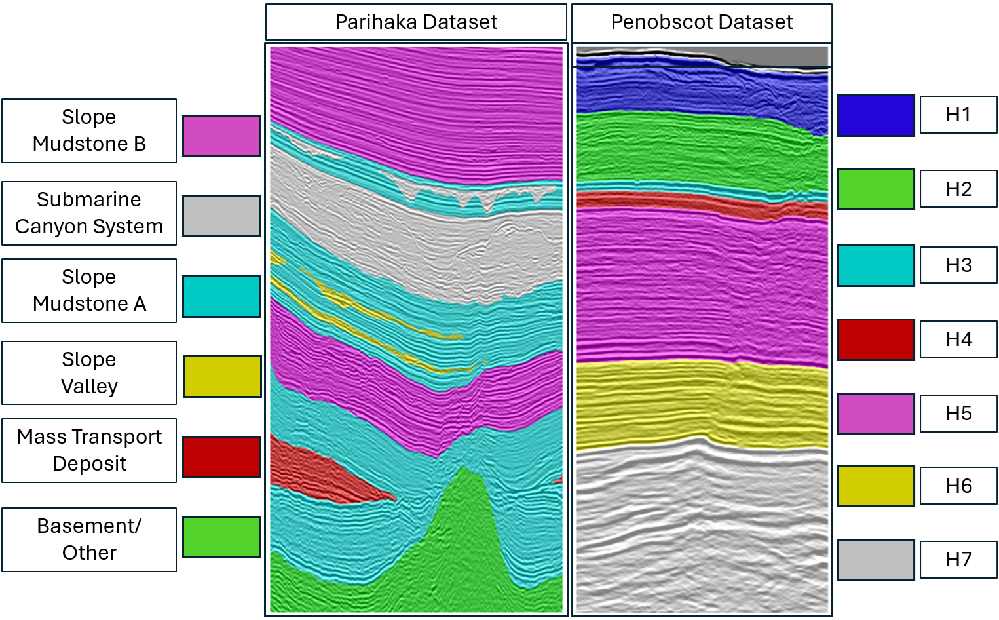
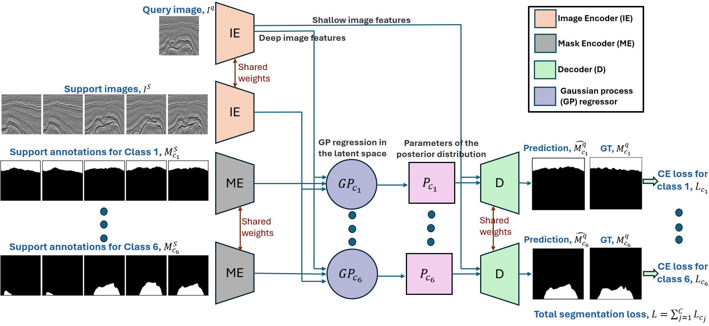
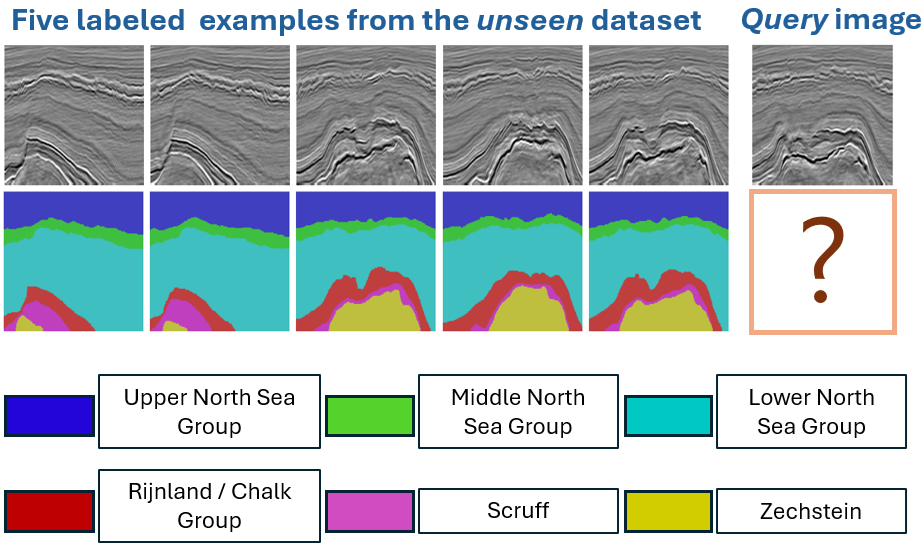
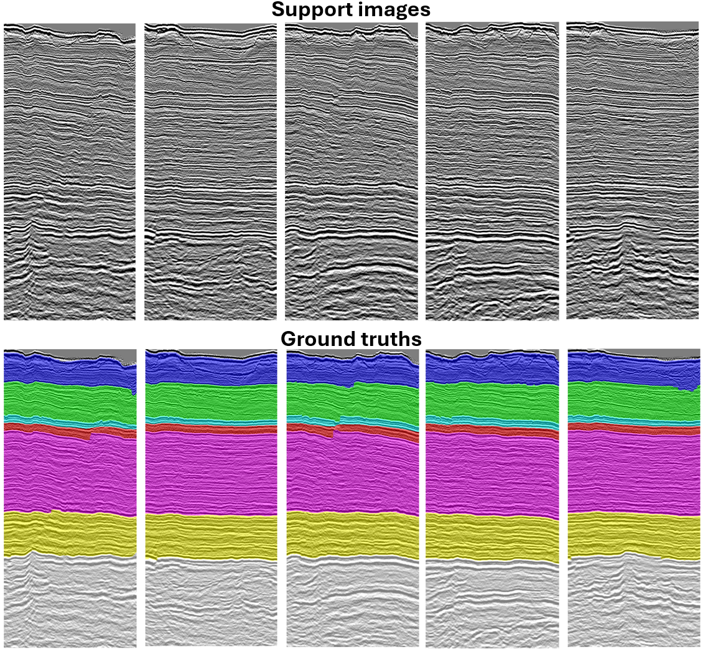
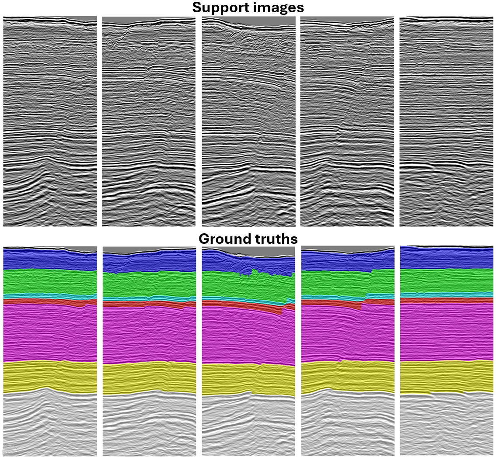

# AdaSemSeg

**AdaSemSeg: An Adaptive Few-shot Semantic Segmentation of Seismic Facies**

[](https://www.python.org/)
[](https://pytorch.org/)
[](LICENSE)

Official reproducibility repository for the paper *AdaSemSeg: An Adaptive Few-shot Semantic Segmentation of Seismic Facies* by [Surojit Saha](mailto:surojit.saha@utah.edu) and [Ross Whitaker](mailto:rosstwhitaker@gmail.com), *IEEE Transactions on Geoscience and Remote Sensing*, 2025.

This repository provides a **complete, working implementation** of AdaSemSeg together with all baselines, competing methods, ablation studies, trained model weights, and reproduction scripts needed to reproduce the quantitative and qualitative results reported in the paper.

## What is AdaSemSeg?

Interpreting seismic facies is a pixel-wise multi-class segmentation task, but annotating 3D seismic volumes is expensive. Few-shot semantic segmentation (FSSS) offers a realistic alternative: given only a handful of annotated slices from a **novel, unseen** seismic volume, predict facies on the remaining slices **without fine-tuning** on the target volume.

Existing FSSS methods require the number of classes to be fixed at training time. This is a problem for seismic facies because different surveys have different numbers of facies and incompatible naming conventions:

| Dataset | Country | Classes | Facies example |
|---|---|---|---|
| **F3** | Netherlands | 6 | Zechstein, Scruff, Chalk, Rijnland, Upper Germanic, Lower Germanic |
| **Parihaka** | New Zealand | 6 | Waihou, Wai-iti, Maxwell, Manganui, Mt. Messenger, Urenui |
| **Penobscot** | Canada | 7 | Horizon groups 1–7 |

<p align="center">
  
  <br/>
  <em>Figure 1: Seismic facies datasets differ in both the number of facies and their naming conventions, making a fixed-class segmentation model impractical.</em>
</p>

**AdaSemSeg** addresses this by decomposing multi-class segmentation into a set of **class-agnostic binary segmentation tasks** that share a single backbone. The number of binary tasks scales with the number of facies in the current dataset, so the architecture itself never has to change. A shared DGPNet backbone performs Gaussian-process regression in the latent space for each facies independently; the final multi-class label is obtained by aggregating the binary predictions.

<p align="center">
  
  <br/>
  <em>Figure 2: AdaSemSeg training overview. A shared DGPNet predicts class-wise binary masks; the same weights are reused for every facies, so the model naturally adapts to varying class counts.</em>
</p>

At inference time, only a few annotated support slices from the target volume are needed:

<p align="center">
  
  <br/>
  <em>Figure 3: Given only a few annotated slices (support set) from an unseen seismic volume, AdaSemSeg predicts the facies label for every pixel in a query slice.</em>
</p>

### Key design choices

- **Adaptive class count**: Because each facies is handled as a separate binary task, AdaSemSeg can be trained jointly on datasets with different numbers of facies.
- **No target-domain fine-tuning**: Parameters are meta-trained on source datasets; target data only supplies the support set.
- **Seismic-aware initialization**: The image encoder is initialized with **SimCLR** representations learned from unlabeled seismic data, avoiding dependence on ImageNet statistics.
- **GP regression in latent space**: Gaussian-process regression at the bottleneck and decoder layers provides robust adaptation from few support examples.

## Repository contents

- `methods/adasemseg/` — Proposed AdaSemSeg method
- `methods/baselines/` — Baseline-1, Baseline-2, and transfer-learning experiments
- `methods/protosemseg/` — Competing prototype-based few-shot method
- `pretraining/simclr/` — Self-supervised SimCLR pretraining for the image encoder
- `configs/` — Unified `datasets.yaml` and shared hyperparameters
- `scripts/` — One-command evaluation and reproduction wrappers
- `checkpoints/` — AdaSemSeg best-model weights + SimCLR initialization checkpoint
- `docs/` — Paper figures, method descriptions, HTML summaries, and `running.md`
- `REPRODUCE.md` — Step-by-step reproduction of every table/figure in the paper

## Installation

```bash
# Create a conda environment
conda env create -f environment.yml
conda activate adasemseg

# Or use pip
pip install -r requirements.txt
```

## Download datasets and weights

Datasets and trained weights are hosted externally via **IEEE DataPort** (URL will be added after upload). After the URL is configured, run:

```bash
python scripts/download_assets.py --all
```

Model weights already shipped in the repository are tracked with **Git LFS**. After cloning, pull them with:

```bash
git lfs pull
```

By default the code looks for data under `./data`:

```
data/
├── F3/
│   ├── train/...
│   ├── test/...
│   └── split_train_val_test_f3.json
├── Parihaka/
│   ├── parihaka_facies_train_images.npy
│   ├── parihaka_facies_train_labels.npy
│   └── split_train_val_test_parihaka.json
└── Penobscot/
    ├── seismic.npy
    ├── seismic_labels.npy
    └── split_train_val_test_penobscot.json
```

To use a different location, set:

```bash
export ADASEMSEG_DATA_ROOT=/path/to/data
```

On Windows PowerShell:
```powershell
$env:ADASEMSEG_DATA_ROOT = "C:\path\to\data"
```

## Quick evaluation

Evaluate a published AdaSemSeg checkpoint using its paper scenario from `checkpoints/scenarios.json`:

```bash
# 5-shot sampling on F3 (trained on Parihaka + Penobscot)
python scripts/evaluate_adasemseg.py --scenario simclr_5-shot_sampling_f3 --device cuda:0

# Nearest-slice evaluation on Parihaka (trained on F3 + Penobscot)
python scripts/evaluate_adasemseg.py --scenario simclr_5-shot_nearest_slice_parihaka --device cuda:0

# Crossline-only evaluation on Penobscot
python scripts/evaluate_adasemseg.py --scenario simclr_5-shot_sampling_penobscot --classes penobscot_facies_data_crossline --device cuda:0
```

See [`checkpoints/scenarios.json`](checkpoints/scenarios.json) for the full list of available scenarios, and [`REPRODUCE.md`](REPRODUCE.md) for reproducing every table and figure in the paper.

## Results

### Support-set sampling: K-shot vs. nearest slice

AdaSemSeg is evaluated with two support-set strategies. For **F3** and **Penobscot**, using K=5 support slices spanning the volume works best. For **Parihaka**, structural variation along both axes makes the **nearest slice** more effective.

#### Inline direction

| Dataset | K=5 | PA | MCA | FwIoU | FwF1 | Nearest | PA | MCA | FwIoU | FwF1 |
|---|---:|---:|---:|---:|---:|:---:|---:|---:|---:|---:|
| **F3** | ✗ | **0.89** | **0.79** | **0.81** | **0.89** | ✓ | 0.85 | 0.73 | 0.78 | 0.85 |
| **Penobscot** | ✗ | 0.95 | 0.95 | 0.91 | 0.96 | ✓ | **0.96** | **0.95** | **0.94** | **0.97** |
| **Parihaka** | ✗ | 0.78 | 0.68 | 0.66 | 0.79 | ✓ | **0.86** | **0.76** | **0.76** | **0.86** |

#### Crossline direction

| Dataset | K=5 | PA | MCA | FwIoU | FwF1 | Nearest | PA | MCA | FwIoU | FwF1 |
|---|---:|---:|---:|---:|---:|:---:|---:|---:|---:|---:|
| **F3** | ✗ | **0.87** | **0.73** | **0.80** | **0.88** | ✓ | 0.80 | 0.58 | 0.71 | 0.81 |
| **Penobscot** | ✗ | **0.97** | **0.95** | **0.93** | **0.96** | ✓ | 0.96 | 0.94 | 0.92 | 0.95 |
| **Parihaka** | ✗ | 0.79 | 0.65 | 0.67 | 0.80 | ✓ | **0.84** | **0.68** | **0.74** | **0.85** |

*Table 1: AdaSemSeg evaluation using K=5 support examples vs. the nearest slice. Bold = best per row. More details in REPRODUCE.md.*

### Comparison with competing methods

AdaSemSeg is compared against **ProtoSemSeg** (a prototype-based FSSS method) and **transfer learning** (a U-Net fine-tuned on a few target slices). AdaSemSeg consistently outperforms both, often by large margins, despite never fine-tuning on the target dataset.

| Target dataset | Shots | Metric | AdaSemSeg | ProtoSemSeg | Transfer learning |
|---|---|---|---:|---:|---:|
| Parihaka inline | 1 | FwF1 | **0.84** | 0.52 | 0.54 |
| Parihaka inline | 5 | FwF1 | **0.86** | 0.58 | 0.62 |
| Penobscot inline | 1 | FwF1 | **0.93** | 0.58 | 0.67 |
| Penobscot inline | 5 | FwF1 | **0.96** | 0.71 | 0.89 |
| F3 inline | 1 | FwF1 | **0.85** | 0.55 | 0.84 |
| F3 inline | 5 | FwF1 | **0.89** | 0.68 | 0.84 |

*Table 2: Selected FwF1 scores from the full few-shot comparison. See REPRODUCE.md for the complete PA / MCA / FwIoU / FwF1 table across all datasets and both 1-shot and 5-shot settings.*

### Ablation: SimCLR initialization

Initializing the image encoder with SimCLR representations learned from unlabeled seismic data substantially improves AdaSemSeg on the challenging Parihaka dataset:

| Shots | Init | PA | MCA | FwIoU | FwF1 |
|---|---:|---:|---:|---:|---:|
| 1 | Random | 0.61 / 0.56 | 0.58 / 0.50 | 0.48 / 0.42 | 0.64 / 0.59 |
| 1 | **SimCLR** | **0.84 / 0.82** | **0.75 / 0.71** | **0.74 / 0.71** | **0.84 / 0.83** |
| 5 | Random | 0.72 / 0.55 | 0.66 / 0.57 | 0.59 / 0.43 | 0.72 / 0.60 |
| 5 | **SimCLR** | **0.86 / 0.84** | **0.76 / 0.68** | **0.76 / 0.74** | **0.86 / 0.85** |

*Table 3: SimCLR vs. random initialization on Parihaka inline / crossline. SimCLR initialization consistently produces the best scores.*

### Qualitative results

Below are example support sets and predictions on the Penobscot dataset. AdaSemSeg captures thin, geologically consistent facies boundaries even though it was trained only on F3 and Parihaka.

<p align="center">
  
  <br/>
  <em>Figure 4: Penobscot inline support images, ground truths, and AdaSemSeg predictions.</em>
</p>

<p align="center">
  
  <br/>
  <em>Figure 5: Penobscot crossline support images, ground truths, and AdaSemSeg predictions.</em>
</p>

## Reproducing the paper

Every table and figure reported in the paper can be reproduced from this repository:

| Paper item | Script / command | Location |
|---|---|---|
| Table 1 — K-shot vs. nearest slice | `python scripts/reproduce_table1.py` | `scripts/` |
| Table 2 — Baselines on target data | `python scripts/reproduce_table2.py` | `scripts/` |
| Table 3 — ProtoSemSeg & transfer learning | `python scripts/reproduce_table3.py` | `scripts/` |
| Table 5 — Initialization ablation | `python scripts/reproduce_table5.py` | `scripts/` |
| Table 6 — Data augmentation ablation | `python scripts/reproduce_table6.py` | `scripts/` |
| Table 7 — Inference time (GPU / CPU) | `python scripts/reproduce_table7.py` | `scripts/` |
| Table 8 — Sensitivity to under-represented classes | `python scripts/reproduce_table8.py` | `scripts/` |
| Prediction figures | `python scripts/reproduce_figures.py` | `scripts/` |
| Per-scenario evaluation | `python scripts/evaluate_adasemseg.py --scenario <name>` | `scripts/` |

Detailed commands, dataset splits, and expected outputs are documented in [`REPRODUCE.md`](REPRODUCE.md) and [`docs/running.md`](docs/running.md).

## Model weights

Selected best-model checkpoints for AdaSemSeg and the SimCLR pretraining weight are included in this repository via Git LFS:

- `checkpoints/adasemseg/` — Best AdaSemSeg checkpoints for the main paper scenarios
- `checkpoints/simclr/` — SimCLR ResNet50 checkpoint used to initialize the image encoder
- `checkpoints/scenarios.json` — Maps each paper scenario to its checkpoint, shot count, support strategy, and classes

ProtoSemSeg checkpoints and intermediate training checkpoints are not included in this repository push; they will be made available via IEEE DataPort.

## Citation

If you use this code, data, or trained weights, please cite:

```bibtex
@article{saha2025adasemseg,
  title={AdaSemSeg: An Adaptive Few-shot Semantic Segmentation of Seismic Facies},
  author={Saha, Surojit and Whitaker, Ross},
  journal={IEEE Transactions on Geoscience and Remote Sensing},
  year={2025}
}
```

## License

This project is released under the MIT License. See [LICENSE](LICENSE) for details.
